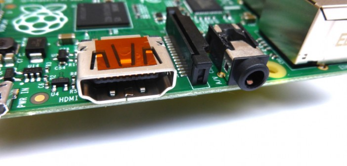
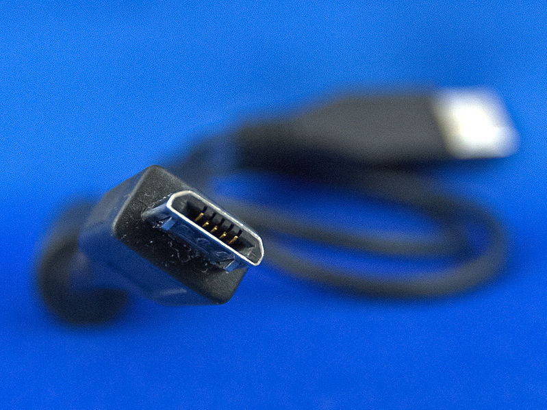

= RPi Hardware Basic Setup

=== Typical Hardware You Will Need

You buy the board, but you will need some extra parts to be able to use it. Some of those parts you may have around so you can use them, some you might buy that others have given away or sold, and some you buy yourself. Consider what you buy; you might get very little benefit from an expensive item over a cheap one. 

The Raspberry Pi can be used in the conventional computer configuration, with a keyboard, mouse and display, or in a "headless" configuration where it is available on a network and is controlled from another computer on that network. Fr the Robot we be using the Raspberry Pi in the headless configuation.

|====
| Item | Conventional | Headless
|Raspberry Pi board | Yes | Yes
|Power Supply | Yes | Yes
|SD Card + OS | Yes | Yes
|USB keyboard | Yes | No
|USB mouse | If using a GUI desktop | No
|Display | Yes | No
|Display cable | Yes | No
|Network cable | If network / Internet | Not possible if Model A; Yes if not Wi-Fi
|Wi-Fi USB adapter | If network / Internet | Yes
|Powered USB hub | If High Power USB device | No
|Another PC / laptop, etc. | No | Yes
|====

.USB Hub
[IMPORTANT]
====
For USB devices other than a mouse and a simple wired keyboard (for USB devices drawing more than 100 mA) a powered USB hub is strongly recommended. A technical discussion as to why can be found http://www.raspberrypi.org/phpBB3/viewtopic.php?f=24&t=5830[here]. Specifically the Raspberry Pi's built in USB hub is designed only for "single current unit" USB devices. Note that when using Revision 2 (or later) boards the problem has been mitigated somewhat with the removal of the USB polyfuses, still due to the limited current the Raspberry Pi can provide to USB devices, due to its main polyfuse, its still recommended to use a hub for all USB peripherals requiring more than 100 mA.
====

Other, optional equipment includes:

*   Case
*   SD card reader - if you need to prepare your own SD card
*   Power Supply Switch - if you want an easy way to cycle power

=== Power Supply

The unit uses a Micro USB connection to power itself (only the power pins are connected - so it will not transfer data over this connection). A standard modern phone charger with a micro-USB connector will do, but needs to produce at least 700 mA at 5 volts (Model B). Check your power supply's ratings carefully.

**Pi Specific power supplies**

A few power supplies have been manufactured specially for the Raspberry Pi to account for voltage drop due to the high current draw of the Raspberry Pi when compared to typical (phone charging, etc.) duties.

.beware cheap knock-offs!
[WARNING]
====
https://www.raspberrypi.org/forums/viewtopic.php?&t=2149[knock-offs]
====

*   A 5 V 2 A supply available in UK, EU and USA varieties 

*  A-Star 32U4 Robot Controller with Raspberry Pi Bridge

**   **LV**: 2.7 V to 11 V (PRSG is using this one)
**   **SV**: 5.5 V to 36 V 

=== Prepared Operating System SD Card

The Raspberry Pi has no internal storage or built-in boot code, so it requires an SD-Card that is set up to boot the Raspberry Pi. You will need a card larger than 8GB for the full ROS install.

=== Keyboard & Mouse

Most standard USB keyboards and mice will work with the Raspberry Pi. Wireless keyboard/mice should also function, and only require a single USB port for an RF dongle. In order to use a Bluetooth keyboard or mouse you would need to use a Bluetooth dongle, which again uses a single port.

Remember that the Model A has a single USB port, the Model B only has two (typically a keyboard and mouse will use a USB port each), and the Model B+ and Raspberry Pi 2 have 4 

Check your mouse and keyboard are compatible with Linux.

=== Display

There are two connection options for the Raspberry Pi display, HDMI (high definition) and composite (low definition).

HD TVs and most LCD Monitors can be connected using a standard HDMI cable. (A cable with a "male"/"plug" connection on the Raspberry Pi end and whatever your display uses on the other end). HDMI versions 1.3 and 1.4 are supported, and a version 1.4 cable is recommended. The Raspberry Pi outputs audio and video via HDMI, but does not have an HDMI input.

.raspberry pi model b 3.5mm audiovideo jack

Most older TVs can be connected using composite (a yellow-to-yellow cable). PAL and NTSC TVs are supported. Note that the RCA output is composite video, not RF, so it cannot be connected directly to the antenna input of a TV. You need to connected it to the yellow video input connector, or to the SCART input using a RCA to SCART plug (adapter). Note that on the model A+ and B+ Raspberry Pi's the composite video output has been combined with the audio connector so you will need a special cable to allow access to the video output. See http://www.raspberrypi-spy.co.uk/2014/07/raspberry-pi-model-b-3-5mm-audiovideo-jack/[http://www.raspberrypi-spy.co.uk/2014/07/raspberry-pi-model-b-3-5mm-audiovideo-jack/] for details of the exact cable required.
It is possible to use a monitor with a DVI input by using an HDMI to DVI adapter or adapter cable. The Raspberry Pi can also be connected to a display with a VGA input through the use of an HDMI to VGA converter. 

.HDMI to VGA cable
[NOTE]
====
Note however that a simple HDMI to VGA cable will not work - it needs to be an "active" converter.
====

The Raspberry Pi will normally output sound on either the HDMI connection or the 3.5 mm analogue output. You can send the sound output from the analogue output of the Raspberry Pi to your TV using a cable that adapts from 3.5 mm TRS to double (red and white) RCA connectors. These red and white can go into the red and white RCA plug inputs of a TV, or a stereo set, or to the above mentioned RCA to SCART plug. On the model A+ and B+ Raspberry Pi's you will need a special TRRS cable to connect the audio if you also want access to the composite video output. A 3.5 mm TRS to dual (red and white) RCA cable will work for the audio if you don't need the composite video output. See http://www.raspberrypi-spy.co.uk/2014/07/raspberry-pi-model-b-3-5mm-audiovideo-jack/[http://www.raspberrypi-spy.co.uk/2014/07/raspberry-pi-model-b-3-5mm-audiovideo-jack/] for details of the exact cable required. Another option for analogue audio is to connect the 3.5 mm jackplug to an amplified speakerset. Do not connect the 3.5 mm jack directly to a headset, as the 3.5 mm audio output isn't suitable to drive headsets, only amplifier inputs. Attaching a low impedance load, (such as a headset) to the stereo audio output may lead to distorted sound.

Using an HDMI to DVI-D (digital) adaptor plus a DVI to VGA adaptor will not work. HDMI does not supply the DVI-A (analogue) needed to convert to VGA - converting an HDMI or DVI-D source to VGA (or component) needs an active converter. (It can work out cheaper to buy a new monitor). Problems have been reported with converters if the power supply is not adequate and the converter is not powered from its own power supply.

=== Cables

You will probably need a number of cables in order to connect your Raspberry Pi up.

.  Micro-B USB Power Cable (see above)
.  HDMI-A http://en.wikipedia.org/wiki/File:HDMI.jpg[picture] or Composite cable http://en.wikipedia.org/wiki/File:Composite-video-cable.jpg[picture], plus DVI adaptor http://en.wikipedia.org/wiki/File:Adapter_dvi_hdmi_S7302224_wp.jpg[picture] or SCART adaptor http://en.wikipedia.org/wiki/File:Multiconnector-scart-chti.jpg[picture] if required, to connect your Raspberry Pi to the Display/Monitor/TV of your choice.
.  Audio cable http://en.wikipedia.org/wiki/File:Audio-TRS-Mini-Plug.jpg[picture], this is not needed if you use a HDMI TV/monitor.
.  Ethernet/LAN Cable (see below) http://en.wikipedia.org/wiki/File:Ethernet_RJ45_connector_p1160054.jpg[picture].
The price you pay for an HDMI cable can vary wildly and under most circumstances a low-cost cable from a reputable online or local supplier will be absolutely fine, but the definition of what constitutes 'low cost' can vary wildly - for example, in the UK, a 1 m cable can be purchased for anything between £1 and £24.99. If, however, you want to drive a display some distance from the Raspberry Pi (say greater than the ubiquitous 1.8 m/6 ft), or you are using a video switch to share a display between several devices, then higher quality cables might be wise - for example, a pair of 1 m HDMI cables purchased in a UK 'pound shop' worked fine when directly connected between the Raspberry Pi and a display, but would not give a stable picture when used via an HDMI switch. Replacing the £1 1 m cable with a 1.5 m cable bought online for £1.30 fixed the problem. For more insight: http://www.techradar.com/news/video/why-you-dont-need-to-spend-more-than-2-on-an-hdmi-cable-1071343[Why you don't need to spend more than £2 on an HDMI cable]

=== Network / Internet Connectivity

This may be an Ethernet/LAN cable (standard RJ45 connector) or a USB Wi-Fi adaptor. The Raspberry Pi Ethernet port is auto-sensing which means that it may be connected to a router or directly to another computer (without the need for a crossover cable^http://elinux.org/RPi_Hardware_Basic_Setup#cite_note-autoMDIX-1[[1]]^).

Support for USB Wi-Fi adaptors will vary - see http://elinux.org/RPi_VerifiedPeripherals[Raspberry Pi Verified Peripherals].

.Netgear router
[NOTE]
====
If a Netgear router has a blank in the fourth box of the subnet mask, raspbian will interpret that as a 255, not as a '0' like Ubuntu. This will give you a subnet mask of 255.255.255.255 and a useless network connection. Changing the router's setting to put a '0' in the last field and reinitializing the network will fix this.
====

=== USB-Hub

In order to connect additional devices to the Raspberry Pi, you may want to obtain a USB Hub, which will allow multiple devices to be used.

It is recommended that a **powered** hub is used - this will provide any additional power to the devices without affecting the Raspberry Pi itself. The USB ports are fused at about 140 mA each without an additional external power source. This is not enough to power a hard drive, and you may even have trouble powering wireless adapters and other peripherals. There is enough current out there, however, for mice and most keyboards.

USB version 2.0 is recommended. USB version 1.1 is fine for keyboards and mice, but may not be fast enough for other accessories.

=== Real Time Clock

Laptops and computers keep time when the power is off by using a pre-installed, battery powered 'Real Time Clock' (RTC). However, this Real Time Clock module is not included with the Raspberry Pi. To keep time, the Raspberry Pi updates the date and time automatically over the Internet via Ethernet or Wi-Fi. For projects which have no Internet connection, you may want to add a low cost battery powered RTC to help your Raspberry Pi keep time!

Afterthought Software have released a 'Plug and Play' Real Time Clock designed specifically for the Raspberry Pi which, unlike other RTC's available, plugs directly in to the Raspberry Pi's GPIO Ports. The unit, and others, are available from https://www.modmypi.com/search/?search=rtc[[2]] and comes complete with an easy to follow https://www.modmypi.com/blog/installing-the-rasclock-raspberry-pi-real-time-clock[Installation Guide].

=== Another PC

If you need to install the Operating System on your own SD Card you will need another PC, Laptop or Mac to do so (or get a friend or local group to do it for you). If you are running headless, you also need one, though for a lot of uses (but not all) you can use a tablet or smart phone. This does include another Raspberry Pi!

